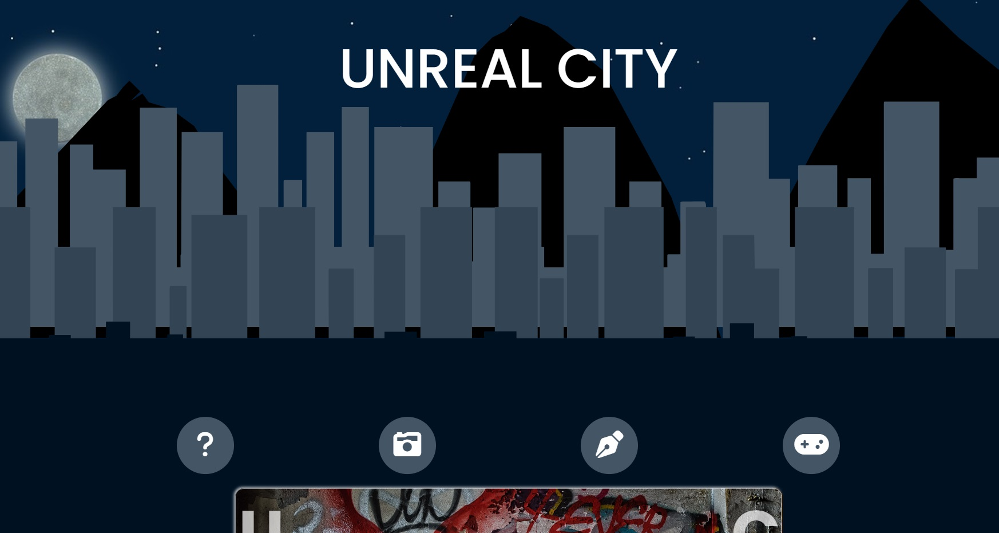

# Unreal City
This is very much so a work in progress and I can't pretend to know 
what direction it will head yet. But I can see a bit of a shape for it now. 

I am just beginning my journey as a web developer, but already I see so much potential.
I intend to hone my skills and fill my portfolio with many immaculate and polished
projects. However, I also like to have fun when I'm learning. Unreal City, as it exists 
now, is a grungy playground for me to get curious and little funky with my skills. 

More to come 

## Badges

## Main Edits Needed
- This project is going to begin primarily as a display for my photography 
on my city outings. 
- Current work is mostly being done on landing page 

## Subpages 
- Poetry
- Gallery
- Games Room
- [redacted]

